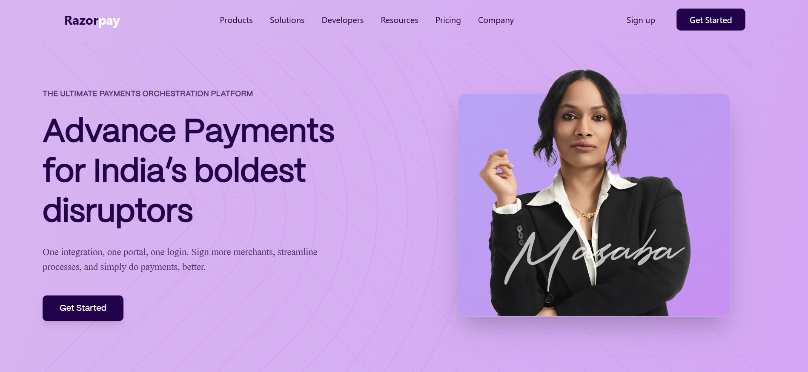
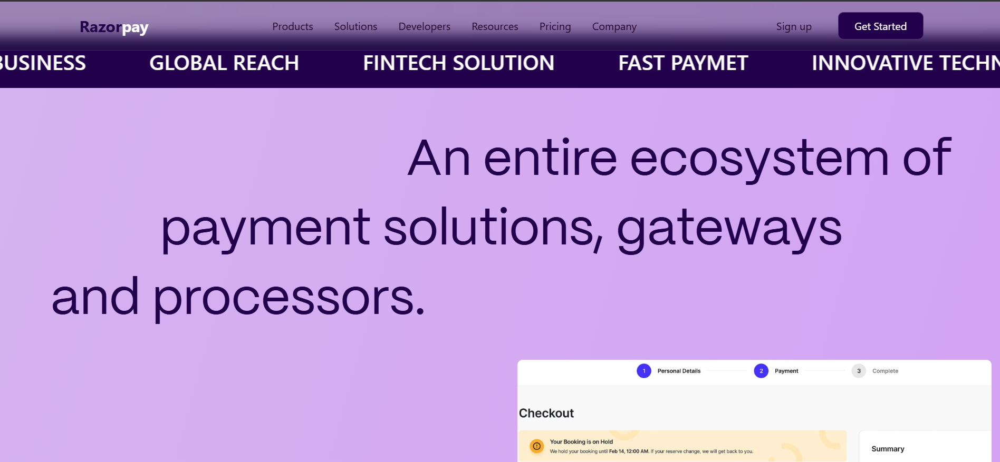
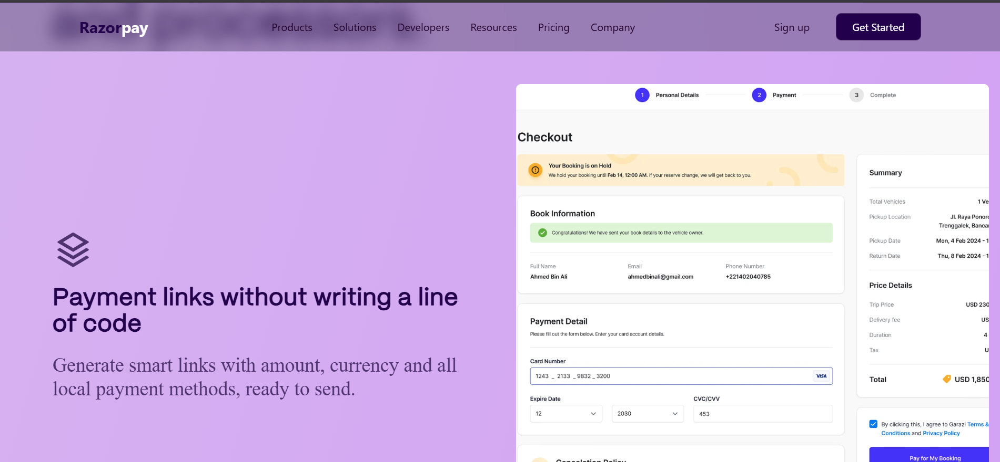
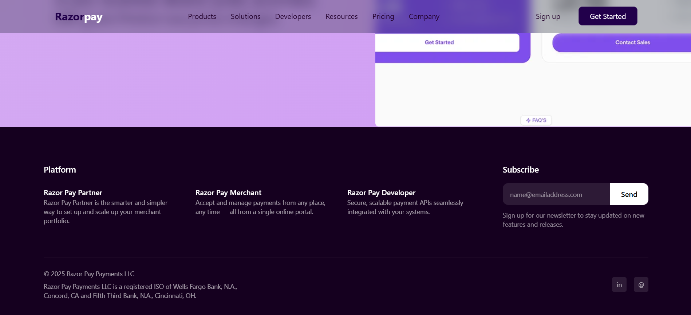

# Razorpay Redesign

A modern, responsive redesign/clone of the Razorpay website built with **React**, **Vite**, and **Tailwind CSS**. This project features smooth animations using **GSAP** and **Framer Motion**, creating a premium user experience.

## 🚀 Features

- **Modern UI/UX**: Clean and professional design inspired by Razorpay.
- **Responsive Design**: Fully optimized for desktop, tablet, and mobile devices.
- **Smooth Animations**:
  - **GSAP** for high-performance animations.
  - **Framer Motion** for complex gesture-based interactions.
  - **Fade Effects**: Custom fade-in animations (FadeRight, FadeUp).
- **Interactive Elements**:
  - Infinite Marquee for partner/client logos.
  - Dynamic Navigation Bar.
  - Scroll-triggered animations.

## 🛠️ Tech Stack

- **Frontend Framework**: [React](https://react.dev/)
- **Build Tool**: [Vite](https://vitejs.dev/)
- **Styling**: [Tailwind CSS](https://tailwindcss.com/)
- **Animations**:
  - [GSAP (GreenSock)](https://gsap.com/)
  - [Framer Motion](https://www.framer.com/motion/)
- **Icons**: [Remix Icon](https://remixicon.com/)
- **Linting**: ESLint

## 📂 Folder Structure

```
razorpay/
├── public/              # Static assets
├── src/
│   ├── assets/          # Images and other assets
│   ├── Components/      # Reusable UI components
│   │   ├── Payment/     # Payment-related components
│   │   │   └── Scroll.jsx
│   │   ├── EntireText.jsx
│   │   ├── Marquee.css
│   │   ├── Marquee.jsx
│   │   └── Navbar.jsx
│   ├── Pages/           # Page components
│   │   ├── Home/
│   │   │   └── Home.jsx
│   │   ├── Footer.jsx
│   │   └── PaymentScroll.jsx
│   ├── App.jsx          # Main App component
│   ├── FadeRight.jsx    # Animation utility
│   ├── FadeUp.jsx       # Animation utility
│   ├── index.css        # Global styles & Tailwind directives
│   └── main.jsx         # Entry point
├── .gitignore
├── index.html
├── package.json
├── postcss.config.js
├── tailwind.config.js
└── vite.config.js
```

## 📸 Screenshots

<!-- Add your screenshots here -->






*(Note: Please add a screenshot of the website in the `public` folder and name it `screenshot.png`)*

## ⚙️ Prerequisites

Before you begin, ensure you have the following installed:
- **Node.js** (v14 or higher)
- **npm** (Node Package Manager)

## 📥 Installation & Setup

Follow these steps to get the project running locally:

1.  **Clone the Repository**
    ```bash
    git clone https://github.com/CodeWith-MUKUL/Razorpay-Redesign
    cd RazorPay
    ```

2.  **Install Dependencies**
    ```bash
    npm install
    ```

3.  **Start the Development Server**
    ```bash
    npm run dev
    ```

4.  **Open in Browser**
    The application will start at `http://localhost:5173` (or similar). Open this URL in your web browser to view the project.

## 📜 Scripts

- `npm run dev`: Starts the development server.
- `npm run build`: Builds the app for production.
- `npm run lint`: Runs ESLint to check for code quality issues.
- `npm run preview`: Previews the production build locally.

## 🤝 Contributing

Contributions are welcome! Please feel free to submit a Pull Request.

1.  Fork the project
2.  Create your feature branch (`git checkout -b feature/AmazingFeature`)
3.  Commit your changes (`git commit -m 'Add some AmazingFeature'`)
4.  Push to the branch (`git push origin feature/AmazingFeature`)
5.  Open a Pull Request

## 📄 License

This project is licensed under the MIT License.
